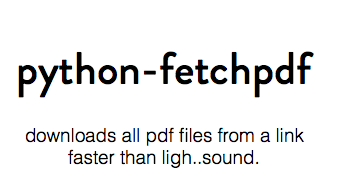

<p align="center">

</p>

<p align="center">
<a href="https://badge.fury.io/py/fetchpdf"></a>


<a href=""></a>
</p>


<br>

##Installation

-  Using PIP

```
pip install fetchpdf
```

-  Using GitHub

```
git clone https://github.com/hemangsk/python-fetchpdf.git
```


<br>

##Usage

```
$ fetchpdf [your-link]
```

```
$ fetchpdf http://textofvideo.nptel.iitm.ac.in/117102060/
```
